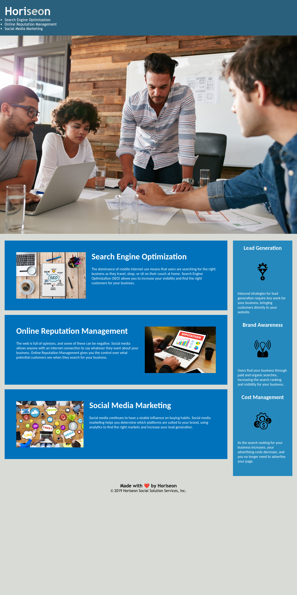

# Bootcamp Challenge 1

## Description 

For this project, the website must meet accessibility standards. This was achieved by completing the following:

* Div elements changed to Semantic HTML elements throughout the source code
* HTML elements follow a logical structure independent of styling and positioning
* Image and icon elements contain accessible `alt` attributes
* Heading attributes fall in sequential order
* Title elements contain a concise, descriptive title

This improved the usability of the inital code with screen readers.

## Installation

The site does not require installation steps.

## Usage 

The website can be viewed at [https://](http://) with Google Chrome. The source can be viewed in Chrome by right clicking and selecting inspect.

To add a screenshot, create an `assets/images` folder in your repository and upload your screenshot to it. Then, using the relative filepath, add it to your README using the following syntax:

```md

```

## Credits

This site was based on a project by edX Boot Camps LLC.

[https://www.w3schools.com/](W3School) was used as a reference for elements to use and good practice.

The changes were checked with [https://validator.w3.org/](W3C Validator).

Recommendations for headers were taken from [https://developer.mozilla.org/en-US/docs/Web/HTML/Element/Heading_Elements](Mozilla guidance on H1 - H6)

## License

This project uses the licence in the LICENCE file of the repo.
